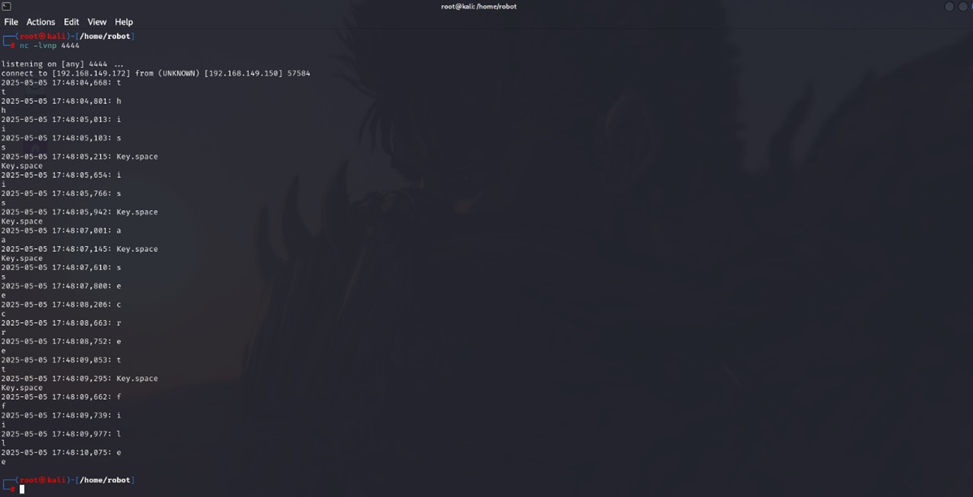

# Malware Simulation – Python Keylogger

This simulation showcases the execution of a **Python-based keylogger** in a controlled red team environment to demonstrate how user keystrokes can be silently captured and exfiltrated.

---

## Objective
- Simulate an endpoint compromise through stealthy keylogging
- Capture keyboard activity from a target machine
- Evaluate detection capabilities of **Wazuh**, **Suricata**, and Windows Defender

---

## Attack Summary

| Aspect            | Detail                                      |
|-------------------|---------------------------------------------|
| Language          | Python (pynput library)                     |
| Functionality     | Logs all keystrokes and saves to file       |
| Persistence       | Can be scheduled or hidden as background task |
| Exfiltration      | (Optional) Email or HTTP POST not enabled in this test |

---

## Execution Flow

1. Python script using `pynput` monitors keystrokes in real time  
2. Data is logged into a hidden file (e.g., `.keylog.txt`)  
3. Logs can be accessed manually by attacker or exfiltrated via other malware

---

## Detection & Response

- **Wazuh** detected suspicious script execution and flagged as behavior anomaly  
- **Windows Defender** did not flag the script when obfuscated  
- **Suricata** had no effect (non-network based attack)

---

## Evidence Screenshot

> Captured keylog output after test execution:

