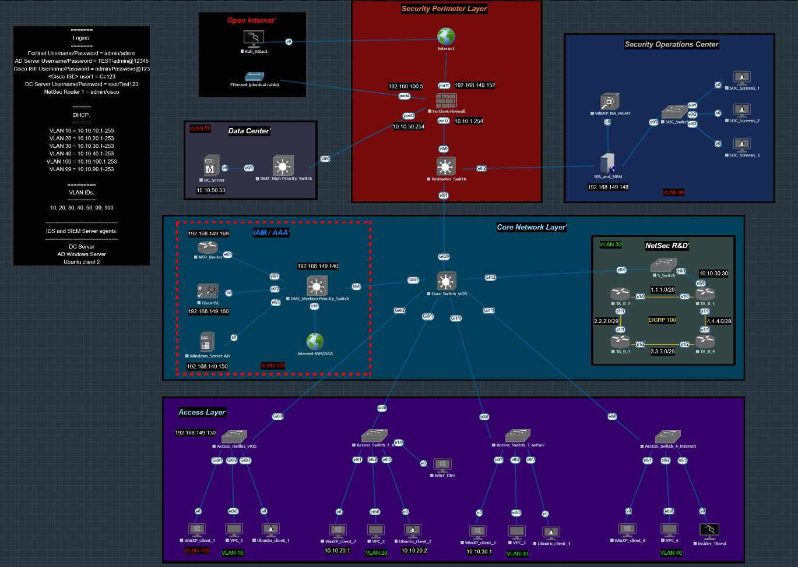

# EVE-NG Network Topology Overview

This section explains the actual EVE-NG topology built to simulate the enterprise SOC environment for CyberFortify.

---

## 🔹 Virtual Devices Used

- **Router (Cisco IOSv)** – Configured with EIGRP, interfaces to switches
- **Switch 1 (Core)** – Trunked with Router and Switch 2, hosts VLANs
- **Switch 2 (Access)** – Connected to endpoints and ISE server
- **Fortinet Firewall** – Placed at the perimeter, filters Layer 3/4 traffic
- **Wazuh SIEM** – Connected via management VLAN, collects logs
- **Suricata IDS** – Listens to mirror port traffic from Fortinet and endpoints
- **Cisco ISE** – Enforces AAA, VLAN assignment via RADIUS
- **Windows Server** – Hosts internal services
- **Kali Linux (Red Team)** – Launches attacks into internal zones

---

## 🔹 VLANs & Interfaces

| VLAN ID | Purpose           | Devices                        |
|---------|-------------------|--------------------------------|
| 10      | Management        | Wazuh, Splunk, ISE             |
| 20      | Endpoints         | Windows 10, Ubuntu             |
| 30      | Server Zone       | Windows Server, CentOS         |
| 40      | DMZ / Red Team    | Kali Machines                  |

- Trunk ports configured between switches and router
- Access ports assigned by ISE using dynamic VLAN assignment

---

## 🧭 Network Flow Example

1. Red Team (Kali) sends brute-force traffic to internal endpoint (192.168.20.X)
2. Suricata detects brute-force pattern on mirrored interface
3. Wazuh logs login failures from SSH or SMB
4. Fortinet blocks excessive requests if policy threshold exceeded
5. Cisco ISE logs user/device attempting access and applies VLAN or blocks

---

## 🖼️ Topology Diagram

---

## Summary

The EVE-NG simulation recreated an enterprise-grade, VLAN-segmented, AAA-enforced network using open-source and enterprise-grade tools to detect and respond to over 15 cyberattacks.

