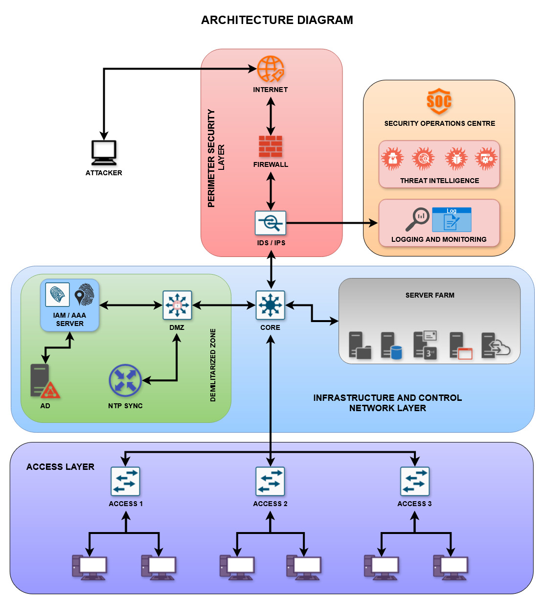

# Project Architecture – CyberFortify

This document explains the complete network and security architecture used to simulate and defend against real-world cyberattacks in the CyberFortify SOC lab.

---

## Network Topology

This diagram represents the segmented security zones and layered defense mechanisms implemented in the virtual SOC lab.

---

## Architecture Components

- **Fortinet Firewall:** Acts as the perimeter defense, filtering traffic from external and internal sources with rule-based access control.
- **Cisco ISE (Identity Services Engine):** Provides AAA (Authentication, Authorization, Accounting) using RADIUS and TACACS+, enforcing role-based access and VLAN segmentation.
- **Suricata IDS:** Deployed for real-time detection of malicious traffic such as brute force, tunneling, and port scans.
- **Wazuh & Splunk SIEMs:** Handle log collection, correlation, and alerting. Provide forensic visibility across all layers of the network.
- **Kali Linux Red Team Machines:** Used to simulate various red team attacks (DDoS, reverse shell, brute-force, DNS/ICMP tunneling).
- **Windows Server & Endpoints:** Represent internal assets being monitored and protected.

---

## Supporting Files

- `architecture_real.jpg` – Network and system architecture overview
- `CyberFortify_Report.pdf` – Complete documentation of all simulated attacks and defense responses
- `architecture.drawio` – Editable diagram source (for updates or future designs)
